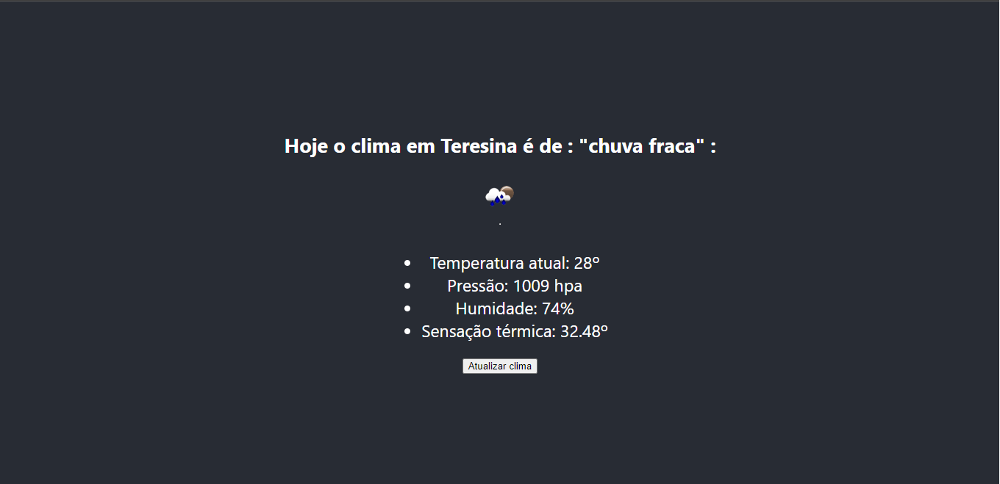

# App para consumo de API de openweathermap;

## Para utilizar:

- Faça um clone do projeto
- Crie um arquivo na raiz do projeto com o nome de: .env
- Dentro do arquivo, informe a varíavel para utilização da sua chave de API criada no site.
- Rode o projeto com `yarn start`

#### Tela de demonstração:

  

[Linkedin](https://www.linkedin.com/in/marcuspo)
